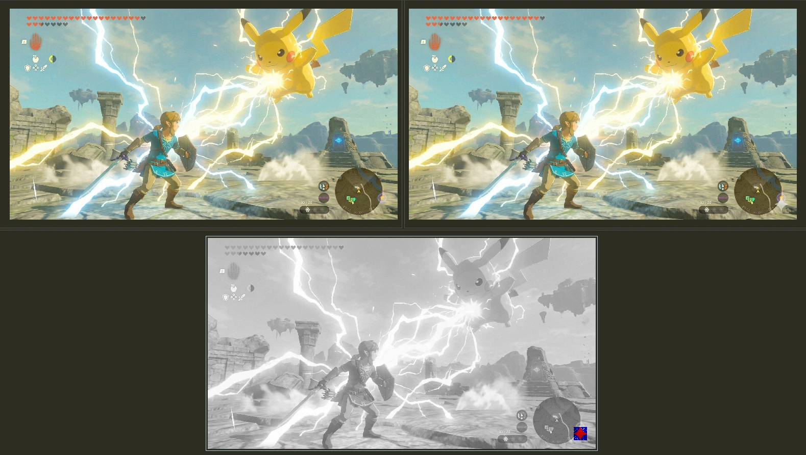
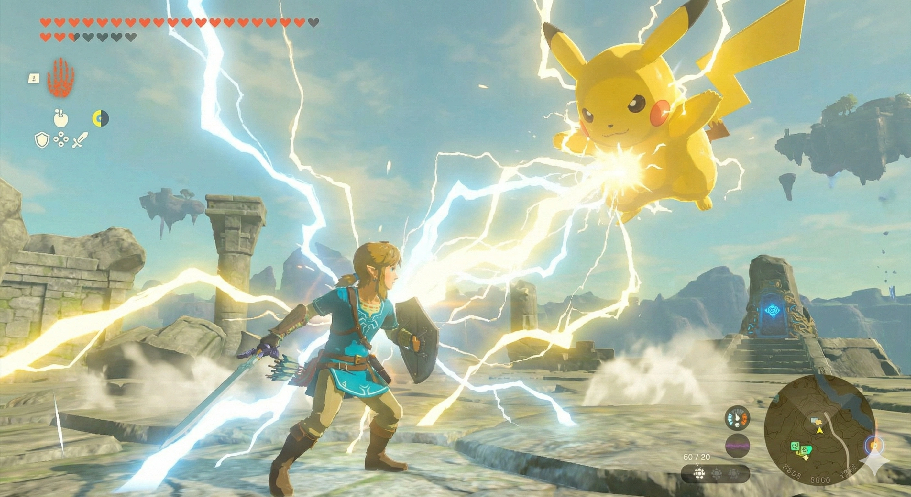
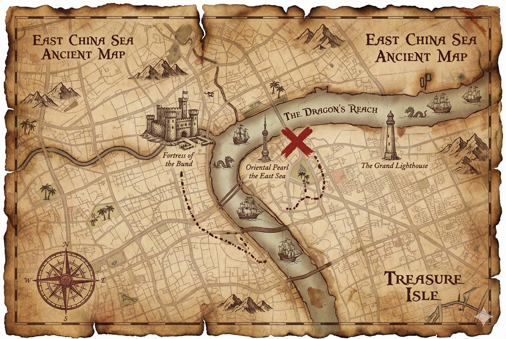
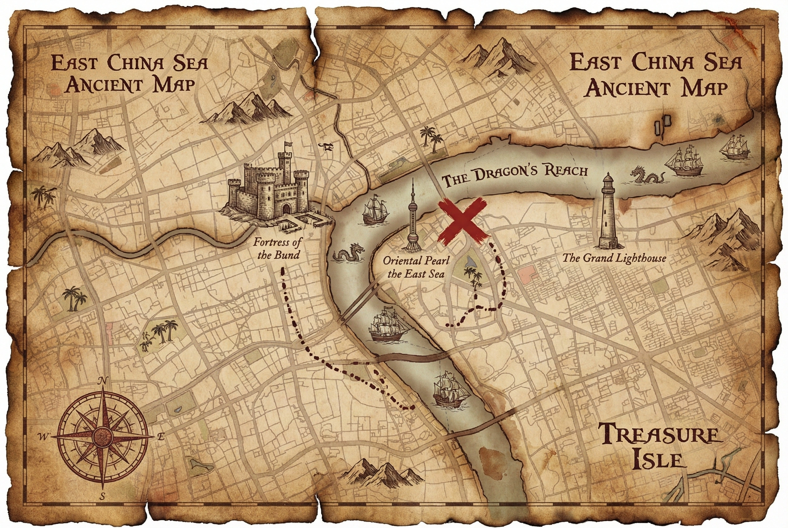
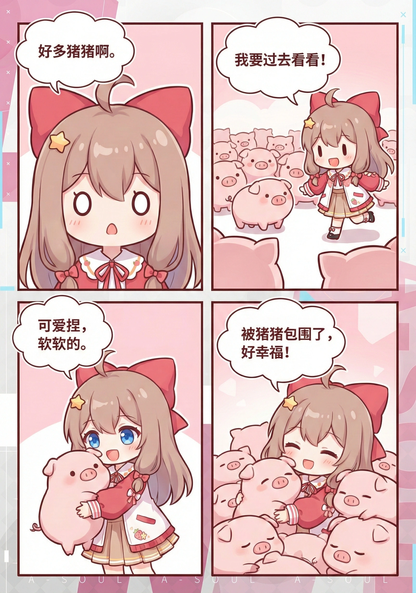

[English](README.md)

# Gemini 无损去水印工具 - [banana.ovo.re](https://banana.ovo.re)

基于 Javascript 的纯浏览器端 Gemini AI 图像无损去水印工具，使用数学精确的反向 Alpha 混合算法

<p align="center">
  
</p>

## 特性

- ✅ **纯浏览器端处理** - 无需后端服务器，所有处理在本地完成
- ✅ **隐私保护** - 图片不会上传到任何服务器
- ✅ **数学精确** - 基于反向 Alpha 混合算法，非 AI 模型
- ✅ **自动检测** - 自动识别 48×48 或 96×96 水印尺寸
- ✅ **易于使用** - 拖拽选择图片，一键处理
- ✅ **跨平台** - 支持所有现代浏览器

## 效果示例

<details open>
<summary>点击查看/收起示例</summary>
　
<p>无损 diff 示例</p>
<p></p>


<p>示例图片</p>

| 原图 | 去水印后 |
| :---: | :----: |
|  |  |
|  |  |
|  |  |
|  |  |
|  |  |

</details>

## ⚠️ 使用需注意

> [!WARNING]
> **使用此工具产生的风险由用户自行承担**
>
> 本工具涉及对图像数据的修改。尽管在设计上力求处理结果的可靠性，但由于以下因素，仍可能产生非预期的处理结果：
> - Gemini 水印实现方式的更新或变动
> - 图像文件损坏或使用了非标准格式
> - 测试案例未能覆盖的边界情况
>
> 作者对任何形式的数据丢失、图像损坏或非预期的修改结果不承担法律责任。使用本工具即代表您已了解并接受上述风险。

> [!NOTE]
> 另请注意：使用此工具需禁用 Canvas 指纹防护扩展（如 Canvas Fingerprint Defender），否则可能会导致处理结果错误。 https://github.com/journey-ad/gemini-watermark-remover/issues/3

## 使用方法

### 在线使用

1. 浏览器打开 [banana.ovo.re](https://banana.ovo.re)
2. 拖拽或点击选择带水印的 Gemini 图片
3. 图片会自动开始处理，移除水印
4. 下载处理后的图片

### 油猴脚本

1. 安装油猴插件（如 Tampermonkey 或 Greasemonkey）
2. 打开 [gemini-watermark-remover.user.js](https://banana.ovo.re/userscript/gemini-watermark-remover.user.js)
3. 脚本会自动安装到浏览器中
4. Gemini 对话页面点击复制或者下载图片时，会自动移除水印

## 开发

```bash
# 安装依赖
pnpm install

# 开发构建
pnpm dev

# 生产构建
pnpm build

# 本地预览
pnpm serve
```

## 算法原理

### Gemini 添加水印的方式

Gemini 通过以下方式添加水印：

$$watermarked = \alpha \cdot logo + (1 - \alpha) \cdot original$$

其中：
- `watermarked`: 带水印的像素值
- `α`: Alpha 通道值 (0.0-1.0)
- `logo`: 水印 logo 的颜色值（白色 = 255）
- `original`: 原始像素值

### 反向求解移除水印

为了去除水印，可以反向求解如下：

$$original = \frac{watermarked - \alpha \cdot logo}{1 - \alpha}$$

通过在纯色背景上捕获水印，我们可以重建 Alpha 通道，然后应用反向公式恢复原始图像

## 水印检测规则

| 图像尺寸条件 | 水印尺寸 | 右边距 | 下边距 |
|------------|---------|--------|--------|
| 宽 > 1024 **且** 高 > 1024 | 96×96 | 64px | 64px |
| 其他情况 | 48×48 | 32px | 32px |

## 项目结构

```
gemini-watermark-remover/
├── public/
│   ├── index.html         # 主页面
│   └── terms.html         # 使用条款页面
├── src/
│   ├── core/
│   │   ├── alphaMap.js    # Alpha map 计算
│   │   ├── blendModes.js  # 反向 alpha 混合算法
│   │   └── watermarkEngine.js  # 主引擎
│   ├── assets/
│   │   ├── bg_48.png      # 48×48 水印背景
│   │   └── bg_96.png      # 96×96 水印背景
│   ├── i18n/              # 国际化语言文件
│   ├── userscript/        # 用户脚本
│   ├── app.js             # 网站应用入口
│   └── i18n.js            # 国际化工具
├── dist/                  # 构建输出目录
├── build.js               # 构建脚本
└── package.json
```

## 核心模块

### alphaMap.js

从背景捕获图像计算 Alpha 通道：

```javascript
export function calculateAlphaMap(bgCaptureImageData) {
    // 提取 RGB 通道最大值并归一化到 [0, 1]
    const alphaMap = new Float32Array(width * height);
    for (let i = 0; i < alphaMap.length; i++) {
        const maxChannel = Math.max(r, g, b);
        alphaMap[i] = maxChannel / 255.0;
    }
    return alphaMap;
}
```

### blendModes.js

实现反向 Alpha 混合算法：

```javascript
export function removeWatermark(imageData, alphaMap, position) {
    // 对每个像素应用公式：original = (watermarked - α × 255) / (1 - α)
    for (let row = 0; row < height; row++) {
        for (let col = 0; col < width; col++) {
            const alpha = Math.min(alphaMap[idx], MAX_ALPHA);
            const original = (watermarked - alpha * 255) / (1.0 - alpha);
            imageData.data[idx] = Math.max(0, Math.min(255, original));
        }
    }
}
```

### watermarkEngine.js

主引擎类，协调整个处理流程：

```javascript
export class WatermarkEngine {
    async removeWatermarkFromImage(image) {
        // 1. 检测水印尺寸
        const config = detectWatermarkConfig(width, height);

        // 2. 获取 alpha map
        const alphaMap = await this.getAlphaMap(config.logoSize);

        // 3. 移除水印
        removeWatermark(imageData, alphaMap, position);

        return canvas;
    }
}
```

## 浏览器兼容性

- ✅ Chrome 90+
- ✅ Firefox 88+
- ✅ Safari 14+
- ✅ Edge 90+

需要支持：
- ES6 Modules
- Canvas API
- Async/Await
- TypedArray (Float32Array, Uint8ClampedArray)

---

## 局限性

- 只去除了 **Gemini 可见的水印**<small>（即右下角的半透明 Logo）</small>
- 无法去除隐形或隐写水印。<small>[（了解更多关于 SynthID 的信息）](https://support.google.com/gemini/answer/16722517)</small>
- 针对 Gemini 当前的水印模式设计<small>（截至 2025 年）</small>

## 免责声明

本工具仅限**个人学习研究**所用，不得用于商业用途。

根据您所在的司法管辖区及图像的实际用途，移除水印的行为可能具有潜在的法律影响。用户需自行确保其使用行为符合适用法律、相关服务条款以及知识产权规定，并对此承担全部责任。

作者不纵容也不鼓励将本工具用于侵犯版权、虚假陈述或任何其他非法用途。

**本软件按“原样”提供，不提供任何形式（无论是明示或暗示）的保证。在任何情况下，作者均不对因使用本软件而产生的任何索赔、损害或其他责任承担任何义务。**

## 许可证

[MIT License](./LICENSE)

## 相关链接

- [Gemini Watermark Tool](https://github.com/allenk/GeminiWatermarkTool)
- [算法原理说明](https://allenkuo.medium.com/removing-gemini-ai-watermarks-a-deep-dive-into-reverse-alpha-blending-bbbd83af2a3f)

## 致谢

基于 [Gemini Watermark Tool](https://github.com/allenk/GeminiWatermarkTool) C++ 版本移植
